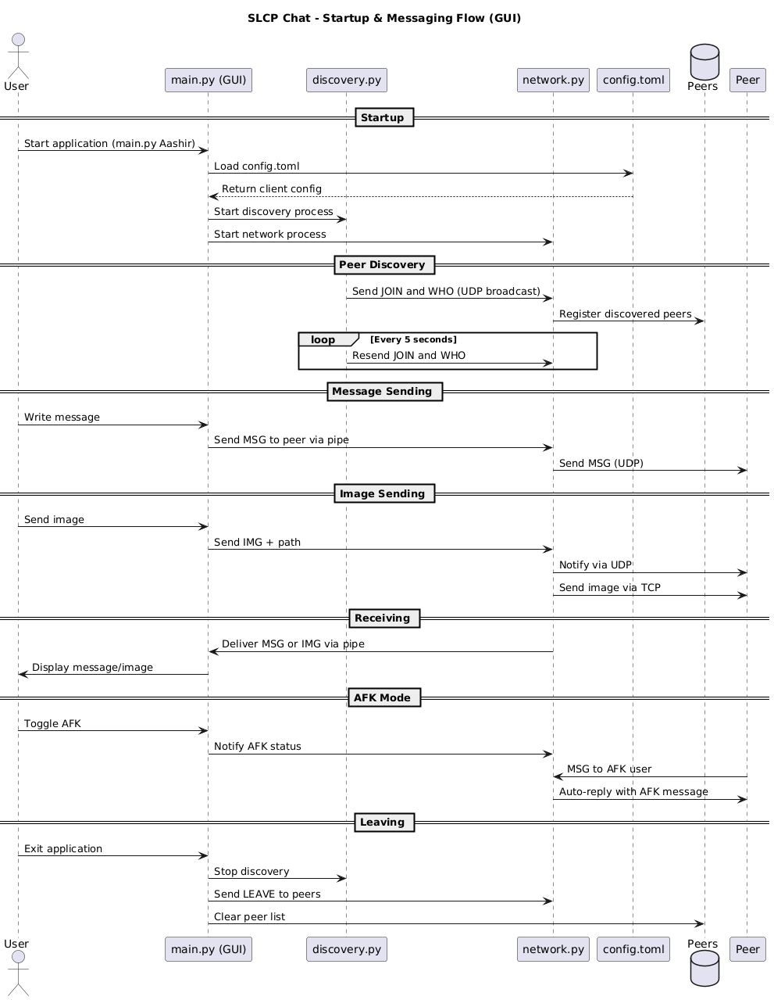
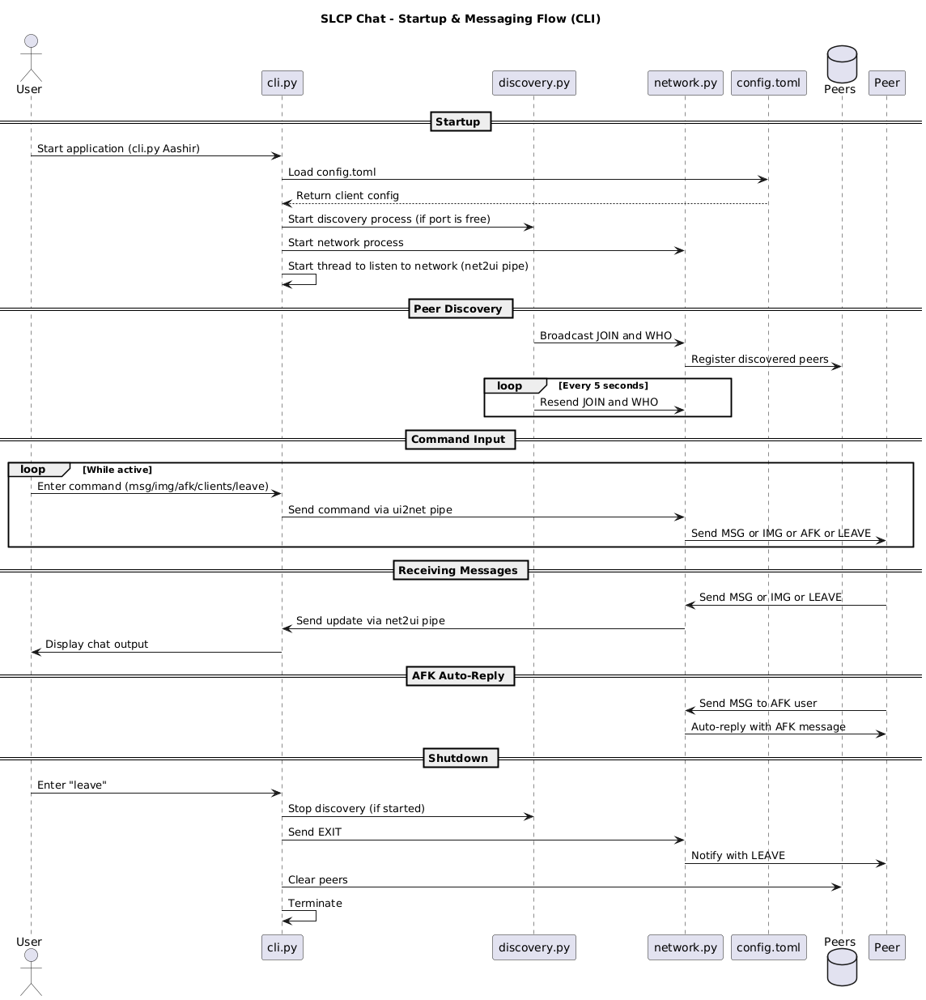

# ChatProgramm_Final

A decentralized, peer-to-peer chat application developed in Python for the **Betriebssysteme und Rechnernetze** (Operating Systems and Computer Networks) course. This project implements a custom protocol called SLCP (Simple Local Chat Protocol) to demonstrate real-time communication over local networks without relying on central servers.

## Project Description

The project aims to simulate a real-world decentralized chat application that supports direct peer-to-peer communication without relying on a central server. By using both UDP and TCP sockets, the system enables:
- Dynamic discovery of other peers
- Text-based chat communication
- Image file sharing
- Away-from-keyboard (AFK) autoreply functionality
- Two fully-featured interfaces: a command-line interface (CLI) and a graphical user interface (GUI)

This system mirrors the principles of modern decentralized applications where reliability, independence, and peer autonomy are key. The communication protocol (SLCP) was developed specifically for this project, ensuring messages are structured, lightweight, and interpretable.

### Challenges Faced

Developing a decentralized peer-to-peer application came with several challenges:
- **Concurrency Management:** Synchronizing multiple processes (network, discovery, GUI, CLI) required careful use of multiprocessing, threading, and pipes.
- **Peer Discovery:** Broadcasting JOIN and WHO messages while avoiding duplicate peers or stale data demanded a reliable protocol logic.
- **Image Transfer:** Transferring large binary files over TCP while signaling over UDP required a clean and fail-safe handshaking mechanism.
- **Interface Parity:** Maintaining full feature parity between CLI and GUI was non-trivial, especially with user interactions.
- **AFK Logic:** Automatically replying with a custom message while avoiding spam loops required careful state tracking.
- **Cross-platform Compatibility:** Ensuring the system runs reliably on Windows, macOS, and Linux involved path handling, port availability checks, and encoding robustness.

---

## Features

- **Peer Discovery:** Broadcast-based peer discovery using `JOIN`, `WHO`, and `KNOWUSERS` messages.
- **Message Exchange:** Real-time message delivery over UDP.
- **Image Transfer:** TCP-based file transfer with UDP notification handshakes.
- **AFK Mode:** Automatic autoreplies when a user is away.
- **Graphical Interface:** Built using PyQt5 with dark/light theme support.
- **Settings Dialog:** Runtime configuration for user handle, port, autoreply message, and image folder.
- **CLI Interface:** Text-based command-line chat interface with full feature parity.
- **Fully Documented:** Comprehensive technical documentation generated using Doxygen.

---

## Architecture

### GUI-Based Execution Flow

 

### CLI-Based Execution Flow



### Core Modules

| Module        | Description                                  |
|---------------|----------------------------------------------|
| `main.py`     | Application entry point with GUI interface   |
| `cli.py`      | Alternative CLI-based interface              |
| `discovery.py`| Broadcast-based peer discovery logic         |
| `network.py`  | Handles UDP messaging, AFK logic, TCP images |
| `gui.py`      | PyQt5-based user interface logic             |
| `config.toml` | TOML configuration for clients and settings  |

---

## Team and Responsibilities

| Name                        | Matrikelnummer | Responsibilities                                                                   |
|-----------------------------|----------------|------------------------------------------------------------------------------------|
| **Aashir Ahtisham**         | 1447390        | Main contributor to `discovery.py`, contributed to `network.py`                    |
| **Bratli Metuka**           | 1505429        | Main contributor to `network.py`, helped with `gui.py`                             |
| **Jalal Eddin Alhaj Ahmad** | 1428348        | Main contributor to `cli.py` and `gui.py`, also worked on `discovery.py`           |
| **Joseph Bolaños Beyloune** | 1534591        | Main contributor to documentation, contributed to `cli.py`, `gui.py`, `network.py` |
| **Ömer Faruk Capraz**       | 1522507        | Main contributor to documentation, helped with `discovery.py` and `cli.py`         |

---

## Installation & Setup

### 1. Install Python 3.10+

Check your version:

```bash
python3 --version
```

If it's lower than 3.10, update it via your platform's instructions.

### 2. Install Dependencies

Use `pip` to install the required packages:

```bash
pip install PyQt5 toml qdarkstyle
```

### Required Packages

| Package        | Purpose                                       |
|----------------|-----------------------------------------------|
| **PyQt5**      | GUI framework (required for `main.py`)        |
| **toml**       | Configuration file parser                     |
| **qdarkstyle** | Optional dark mode for GUI theme              |

---

### 3. Configure Clients

Update the `config.toml` file to define your client settings:

```toml
[[clients]]
handle = "Aashir"
port = [5008, 6000]
whoisport = 4000
autoreply = "Back in one hour"
away = false
imagepath = "./images/aashir"
```

Each client must have a unique `handle`, and ports must not conflict.

The clients can also be updated after the application was launched. 

---

### 4. Launch the Application

To run with the GUI:

```bash
python3 main.py Aashir
```

To run via CLI:

```bash
python3 cli.py Aashir
```

Replace `"Aashir"` with any configured handle in `config.toml`.

---

## Platform-Specific Instructions

### Windows
- Use **PowerShell** or **CMD**.
- Ensure Python is added to PATH.
- Use `python` instead of `python3` if needed.

```cmd
python main.py Aashir
```

### macOS
- Open **Terminal**.
- Use the default Python 3 installation (or via Homebrew).

```bash
python3 main.py Aashir
```

### Linux (Ubuntu/Debian)
- Open **Terminal**.
- Make sure Python 3 and pip are installed:

```bash
sudo apt update
sudo apt install python3 python3-pip
```

- Install dependencies:

```bash
pip3 install PyQt5 toml qdarkstyle
```

- Run the application:

```bash
python3 main.py Aashir
```

---

## GUI Controls

- **Send Message**: Press Enter or click "Send"
- **Send Image**: Select an image via "Send Image" button
- **Clients**: Show connected peers
- **AFK Toggle**: Enable/disable AFK autoreply
- **Settings**: Edit configuration interactively
- **Leave Chat**: Graceful exit

---

## Testing

You can simulate multiple clients by:
- Opening multiple terminal sessions with different handles
- Running on separate machines in the same LAN
- Observing image transfers and peer join/leave messages

---

## Documentation

Doxygen documentation is located at:

```
docs/html/index.html
```

To regenerate:

```bash
doxygen Doxyfile
```

The documentation includes:
- Function and class reference
- Namespace and file structure
- Inline code documentation

---

## Technologies

- **Python 3.10+**  
  The main programming language used for the entire application. Python's high-level syntax and standard library make it ideal for rapid development and academic projects.

- **PyQt5**  
  Used to create the graphical user interface (GUI). Offers support for event-driven programming through signals and slots, as well as cross-platform compatibility.

- **TOML**  
  A minimal and human-readable configuration file format used to define client settings such as handles, ports, autoreplies, and image directories.

- **Socket Programming (UDP/TCP)**  
  Enables real-time communication between peers. UDP is used for message broadcasting (`JOIN`, `WHO`, `MSG`, etc.), while TCP is used for transferring binary image files.

- **Doxygen**  
  Automatically generates HTML-based technical documentation from docstrings and markdown files such as `README.md`.

- **Multiprocessing Pipes (`multiprocessing.Pipe`)**  
  Used for inter-process communication (IPC) between the GUI/CLI and the network process. Allows sending structured messages like `(MSG, handle, message)` through unidirectional or bidirectional channels.

- **Threads (`threading.Thread`)**  
  Used for non-blocking background tasks like periodic broadcasting (`JOIN`, `WHO`) and image transfers. Ensures responsiveness of the GUI and CLI.

- **Shared Memory (via `multiprocessing` state)**  
  Certain configuration states (e.g., AFK status) and message buffers are indirectly synchronized across processes by sharing references during process creation.

- **QDarkStyle**  
  A ready-made dark mode theme applied to the PyQt5 interface for improved aesthetics and readability.
  
---

## Security Notice

This application is designed for academic purposes only.  
It does **not** implement encryption, authentication, or secure transport mechanisms.  
Use only on trusted local networks.

---

## License

MIT License – For educational use only.